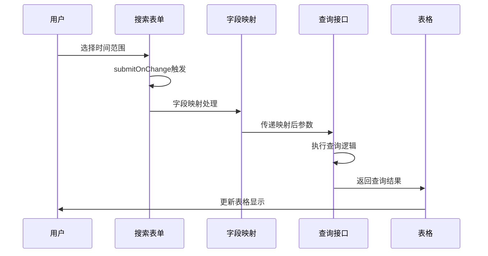
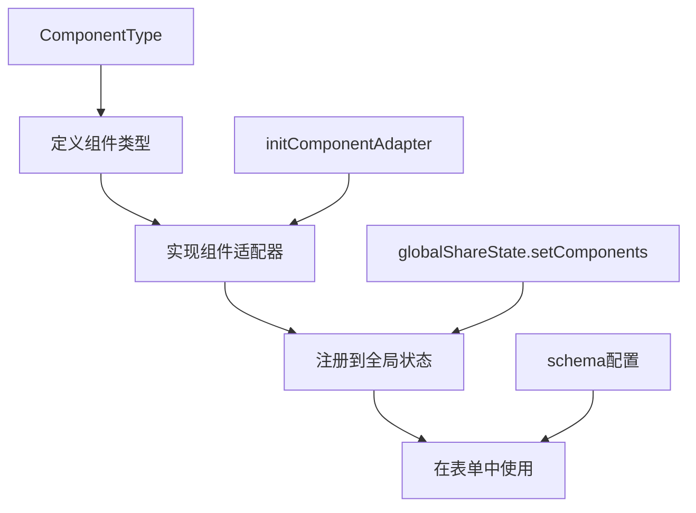

# Vben Vxe Table 表格组件使用指南

## 📋 文档概述

本文档详细介绍了 Vben Vxe Table 表格组件的使用方法，包括基础配置、表单搜索功能、组件注册、样式定制等内容。基于企业能源报表页面的实际开发经验编写。

**创建日期**: 2025-01-20  
**适用版本**: Vben Admin 5.5.7  
**技术栈**: Vue 3 + TypeScript + Element Plus + VXE Table

---

## 1. Vben Vxe Table 简介

### 1.1 什么是 Vben Vxe Table

Vben Vxe Table 是 Vben 官方对 vxe-table 进行二次封装的表格组件，提供了更便捷的配置方式和更丰富的功能。

### 1.2 核心特性

- **统一配置**: 通过 `useVbenVxeGrid` 统一管理表格和表单配置
- **表单搜索**: 内置搜索表单功能，支持多种表单组件
- **类型安全**: 完整的 TypeScript 类型支持
- **组件适配**: 通过适配器模式支持不同UI组件库
- **功能丰富**: 支持分页、排序、筛选、导出等功能

### 1.3 与原生 VXE Table 的区别

| 特性 | 原生 VXE Table | Vben Vxe Table |
|------|---------------|----------------|
| 配置方式 | 分散配置 | 统一配置 |
| 表单搜索 | 需手动实现 | 内置支持 |
| 类型支持 | 基础类型 | 完整 TypeScript |
| 组件适配 | 原生组件 | 适配器模式 |
| 开发效率 | 中等 | 高效 |

---

## 2. 基础使用方法

### 2.1 快速开始

#### 步骤1：定义数据类型

```typescript
// data.ts
export interface EnterpriseEnergyReportData {
  time: string;
  loadSharp: number;
  loadPeak: number;
  loadFlat: number;
  loadValley: number;
  loadDeepValley: number;
  loadTotal: number;
  // ... 其他字段
}
```

#### 步骤2：配置表格列

```typescript
// data.ts
import type { VxeTableGridOptions } from '#/adapter/vxe-table';

export function useColumns(): VxeTableGridOptions<EnterpriseEnergyReportData>['columns'] {
  return [
    // 基础列配置
    {
      align: 'center',
      field: 'time',
      fixed: 'left',
      title: $t('system.energyReport.time'),
      width: 120,
    },
    // 分组列配置
    {
      align: 'center',
      title: $t('system.energyReport.load'),
      children: [
        {
          align: 'center',
          field: 'loadSharp',
          title: $t('system.energyReport.timeSlots.sharp'),
          width: 80,
        },
        {
          align: 'center',
          field: 'loadPeak',
          title: $t('system.energyReport.timeSlots.peak'),
          width: 80,
        },
        // ... 更多子列
      ],
    },
  ];
}
```

#### 步骤3：创建表格实例

```typescript
// index.vue
<script lang="ts" setup>
import { useVbenVxeGrid } from '#/adapter/vxe-table';
import { useColumns } from './data';

const [Grid, gridApi] = useVbenVxeGrid({
  gridOptions: {
    columns: useColumns(),
    height: 'auto',
    proxyConfig: {
      ajax: {
        query: async (_params) => {
          return await getEnergyReportData();
        },
      },
    },
    toolbarConfig: {
      custom: true,
      export: true,
      refresh: { code: 'query' },
      zoom: true,
    },
  },
});
</script>

<template>
  <Grid 
    :table-title="$t('system.energyReport.title')"
    :table-title-help="$t('system.energyReport.description')"
  />
</template>
```

### 2.2 基础配置选项

#### 2.2.1 表格配置 (gridOptions)

```typescript
gridOptions: {
  columns: useColumns(),           // 列配置
  height: 'auto',                  // 表格高度
  keepSource: true,                // 保持数据源
  showFooter: true,                // 显示表尾
  footerData: [{}],               // 表尾数据
  pagerConfig: {                   // 分页配置
    enabled: false,
  },
  proxyConfig: {                   // 数据代理配置
    ajax: {
      query: async (_params) => {
        return await getTableData();
      },
    },
  },
  rowConfig: {                     // 行配置
    keyField: 'id',
  },
  toolbarConfig: {                 // 工具栏配置
    custom: true,                  // 自定义列
    export: true,                  // 导出功能
    refresh: { code: 'query' },    // 刷新按钮
    zoom: true,                    // 全屏切换
  },
}
```

#### 2.2.2 表格事件 (gridEvents)

```typescript
const gridEvents: VxeGridListeners = {
  cellClick: ({ row, column }) => {
    console.log('单元格点击', row, column);
  },
  cellDblclick: ({ row, column }) => {
    console.log('单元格双击', row, column);
  },
  headerCellClick: ({ column }) => {
    console.log('表头点击', column);
  },
};

const [Grid, gridApi] = useVbenVxeGrid({
  gridEvents,
  gridOptions: {
    // ...
  },
});
```

---

## 3. 表单搜索功能

### 3.1 搜索功能配置要求

**⚠️ 重要：搜索功能需要同时满足以下条件（缺一不可）**

1. ✅ 配置 `formOptions` 表单选项
2. ✅ 设置 `showSearchForm: true`
3. ✅ 在 `toolbarConfig` 中设置 `search: true`
4. ✅ 确保表单组件已在适配器中注册

### 3.2 完整搜索配置示例

```typescript
import type { VbenFormProps } from '@vben-core/form-ui';
import dayjs from 'dayjs';

// 表单配置
const formOptions: VbenFormProps = {
  // 表单展示配置
  collapsed: false,                // 默认展开搜索表单
  showCollapseButton: true,        // 显示折叠按钮
  
  // 表单行为配置
  submitOnChange: true,            // 值改变时自动提交
  submitOnEnter: false,            // 按回车时不提交
  
  // 字段映射配置 - 将 RangePicker 映射为两个独立字段
  fieldMappingTime: [['time', ['startTime', 'endTime'], 'YYYY-MM-DD']],
  
  // 表单字段配置
  schema: [
    {
      component: 'RangePicker',
      defaultValue: [dayjs().subtract(7, 'days'), dayjs()],
      fieldName: 'time',
      label: '时间',
      componentProps: {
        placeholder: ['开始时间', '结束时间'],
        format: 'YYYY-MM-DD',
        valueFormat: 'YYYY-MM-DD',
      },
    },
  ],
};

// 表格配置
const [Grid, gridApi] = useVbenVxeGrid({
  formOptions,           // 必须：表单配置
  showSearchForm: true,  // 必须：显示搜索表单
  gridOptions: {
    columns: useColumns(),
    toolbarConfig: {
      search: true,        // 必须：启用搜索按钮
      custom: true,
      export: true,
      refresh: { code: 'query' },
      zoom: true,
    },
    proxyConfig: {
      ajax: {
        query: async (_params, formValues) => {
          // formValues 包含搜索表单的值
          // 结构：{ startTime: '2025-01-01', endTime: '2025-01-07' }
          console.log('搜索参数:', formValues);
          
          const queryParams = {
            ...formValues,
            // 其他查询参数
          };
          
          return await getEnergyReportData(queryParams);
        },
      },
    },
  },
});
```

### 3.3 字段映射详解

#### 3.3.1 时间字段映射原理

```typescript
// 配置
fieldMappingTime: [['time', ['startTime', 'endTime'], 'YYYY-MM-DD']]

// 映射过程
// 表单值：{ time: [dayjs('2025-01-01'), dayjs('2025-01-07')] }
// 映射后：{ startTime: '2025-01-01', endTime: '2025-01-07' }
```

#### 3.3.2 多字段映射示例

```typescript
fieldMappingTime: [
  ['dateRange', ['startDate', 'endDate'], 'YYYY-MM-DD'],
  ['timeRange', ['startTime', 'endTime'], 'HH:mm:ss'],
]
```

### 3.4 搜索表单工作流程



---

## 4. 表单组件使用指南

### 4.1 组件注册机制

#### 4.1.1 适配器作用介绍

适配器模式在 Vben 中的作用：
- **组件统一**: 将不同UI库的组件统一为相同的接口
- **类型安全**: 提供完整的 TypeScript 类型支持
- **功能扩展**: 为组件添加默认配置和额外功能
- **按需加载**: 支持组件的异步加载

#### 4.1.2 组件注册流程



### 4.2 组件注册实践

#### 4.2.1 添加新组件类型

```typescript
// apps/web-ele/src/adapter/component/index.ts
export type ComponentType =
  | 'Input'
  | 'Select'
  | 'DatePicker'
  | 'RangePicker'  // 添加新组件类型
  | 'TimePicker'
  | BaseFormComponentType;
```

#### 4.2.2 实现组件适配器

```typescript
// apps/web-ele/src/adapter/component/index.ts
async function initComponentAdapter() {
  const components: Partial<Record<ComponentType, Component>> = {
    // 基础输入组件
    Input: withDefaultPlaceholder(ElInput, 'input'),

    // 选择组件
    Select: (props, { attrs, slots }) => {
      return h(ElSelectV2, { ...props, attrs }, slots);
    },

    // 日期范围选择器 - 重点实现
    RangePicker: (props, { attrs, slots }) => {
      const { name, id } = props;
      const extraProps: Recordable<any> = {};

      // 处理表单字段名映射
      if (name && !Array.isArray(name)) {
        extraProps.name = [name, `${name}_end`];
      }
      if (id && !Array.isArray(id)) {
        extraProps.id = [id, `${id}_end`];
      }

      return h(
        ElDatePicker,
        {
          ...props,
          ...attrs,
          ...extraProps,
          type: 'daterange',  // 关键：设置为日期范围选择
        },
        slots,
      );
    },
  };

  // 注册组件到全局状态
  globalShareState.setComponents(components);
}
```

### 4.3 支持的表单组件

| 组件名 | 用途 | Element Plus 对应组件 | 配置示例 |
|--------|------|---------------------|----------|
| Input | 文本输入 | ElInput | `{ component: 'Input' }` |
| Select | 下拉选择 | ElSelectV2 | `{ component: 'Select' }` |
| DatePicker | 日期选择 | ElDatePicker | `{ component: 'DatePicker' }` |
| RangePicker | 日期范围选择 | ElDatePicker (type: 'daterange') | `{ component: 'RangePicker' }` |
| TimePicker | 时间选择 | ElTimePicker | `{ component: 'TimePicker' }` |
| InputNumber | 数字输入 | ElInputNumber | `{ component: 'InputNumber' }` |
| Switch | 开关 | ElSwitch | `{ component: 'Switch' }` |
| RadioGroup | 单选组 | ElRadioGroup | `{ component: 'RadioGroup' }` |
| CheckboxGroup | 多选组 | ElCheckboxGroup | `{ component: 'CheckboxGroup' }` |
| TreeSelect | 树形选择 | ElTreeSelect | `{ component: 'TreeSelect' }` |
| Upload | 文件上传 | ElUpload | `{ component: 'Upload' }` |

### 4.4 常用表单组件配置

#### 4.4.1 日期范围选择器

```typescript
{
  component: 'RangePicker',
  fieldName: 'dateRange',
  label: '日期范围',
  defaultValue: [dayjs().subtract(7, 'days'), dayjs()],
  componentProps: {
    placeholder: ['开始日期', '结束日期'],
    format: 'YYYY-MM-DD',
    valueFormat: 'YYYY-MM-DD',
    clearable: true,
  },
}
```

#### 4.4.2 下拉选择器

```typescript
{
  component: 'Select',
  fieldName: 'status',
  label: '状态',
  componentProps: {
    allowClear: true,
    options: [
      { label: '启用', value: 1 },
      { label: '禁用', value: 0 },
    ],
    placeholder: '请选择状态',
  },
}
```

#### 4.4.3 API选择器

```typescript
{
  component: 'ApiSelect',
  fieldName: 'department',
  label: '部门',
  componentProps: {
    api: getDepartmentListApi,
    afterFetch: (data) => {
      return data.map(item => ({
        label: item.name,
        value: item.id,
      }));
    },
    placeholder: '请选择部门',
  },
}
```

#### 4.4.4 文本输入框

```typescript
{
  component: 'Input',
  fieldName: 'keyword',
  label: '关键词',
  componentProps: {
    placeholder: '请输入搜索关键词',
    clearable: true,
  },
}
```

### 4.5 表单验证规则

#### 4.5.1 内置验证规则

```typescript
// 必填验证
rules: 'required'

// 选择必填验证
rules: 'selectRequired'
```

#### 4.5.2 自定义验证规则

```typescript
// 使用 Zod 验证
import { z } from '@vben/common-ui';

// 字符串长度验证
rules: z.string().min(6, '密码至少6位')

// 数字范围验证
rules: z.number().min(0).max(100, '请输入0-100之间的数字')

// 布尔值验证
rules: z.boolean().refine((v) => v, {
  message: '请勾选同意条款'
})

// 复杂验证规则
rules: z.string().regex(/^1[3-9]\d{9}$/, '请输入正确的手机号')
```

---

## 5. 表格高级功能

### 5.1 表尾合计功能

#### 5.1.1 静态表尾配置

```typescript
const [Grid, gridApi] = useVbenVxeGrid({
  gridOptions: {
    showFooter: true,
    footerData: [{
      time: '合计',
      loadSharp: 0,
      loadPeak: 0,
      loadFlat: 0,
      // ... 初始化所有数值字段
    }],
  },
});
```

#### 5.1.2 动态表尾计算

```typescript
// 合计计算函数
function calculateFooterData(data: EnterpriseEnergyReportData[]): EnterpriseEnergyReportData {
  const footerData: any = { time: '合计' };

  if (data.length === 0) return footerData;

  const firstRow = data[0];
  Object.keys(firstRow).forEach(key => {
    if (key !== 'time') {
      const total = data.reduce((sum, row) => {
        const value = Number(row[key as keyof EnterpriseEnergyReportData]) || 0;
        return sum + value;
      }, 0);
      footerData[key] = Number(total.toFixed(1));
    }
  });

  return footerData;
}

// 在查询中动态更新表尾
proxyConfig: {
  ajax: {
    query: async (_params, formValues) => {
      const result = await getEnergyReportData(formValues);

      // 动态计算并更新表尾合计
      if (result.items && result.items.length > 0) {
        const calculatedFooter = calculateFooterData(result.items);
        gridApi.setGridOptions({
          footerData: [calculatedFooter]
        });
      }

      return result;
    },
  },
},
```

### 5.2 工具栏配置

#### 5.2.1 基础工具栏

```typescript
toolbarConfig: {
  search: true,           // 搜索按钮
  custom: true,           // 自定义列
  export: true,           // 导出功能
  refresh: { code: 'query' }, // 刷新按钮
  zoom: true,             // 全屏切换
},
```

#### 5.2.2 自定义工具栏按钮

```typescript
// 在模板中添加自定义按钮
<template>
  <Grid>
    <template #toolbar-tools>
      <ElButton type="primary" @click="onRefresh">
        <IconifyIcon icon="carbon:refresh" class="mr-1 size-4" />
        {{ $t('system.energyReport.refreshData') }}
      </ElButton>
    </template>
  </Grid>
</template>
```

### 5.3 导出功能配置

```typescript
toolbarConfig: {
  export: true,
  exportConfig: {
    filename: '企业能源报表',
    type: 'xlsx',
    modes: ['current', 'selected', 'all'],
    columns: [
      { field: 'time', title: '时间' },
      { field: 'loadTotal', title: '负荷总计' },
      // ... 指定导出的列
    ],
  },
}
```

### 5.4 分页配置

```typescript
gridOptions: {
  pagerConfig: {
    enabled: true,
    pageSize: 20,
    pageSizes: [10, 20, 50, 100],
    layouts: ['PrevJump', 'PrevPage', 'Number', 'NextPage', 'NextJump', 'Sizes', 'Total'],
  },
}
```

---

## 6. 样式定制

### 6.1 表格样式定制

```scss
// 使用深度选择器定制表格样式
:deep(.vxe-table) {
  // 边框合并设置
  border-collapse: collapse;

  // 表头背景色设置
  .vxe-header--column {
    background-color: hsl(var(--primary) / 0.15) !important;
    border-right: 1px solid white;
    border-bottom: 1px solid white;
    font-weight: 600;
  }

  // 深色模式下的表头背景色
  .dark .vxe-header--column {
    background-color: hsl(var(--accent) / 1) !important;
  }

  // 数据行边框使用设计系统颜色
  .vxe-body--column {
    border-right: 1px solid hsl(var(--border));
    border-bottom: 1px solid hsl(var(--border));
  }

  // 悬停效果
  .vxe-body--row:hover {
    background-color: hsl(var(--accent) / 0.1);
  }

  // 移除最后一列的右边框
  .vxe-header--column:last-child,
  .vxe-body--column:last-child {
    border-right: none;
  }

  // 表尾样式
  .vxe-footer--column {
    background-color: hsl(var(--muted));
    font-weight: 600;
  }
}
```

### 6.2 搜索表单样式

```scss
// 搜索表单样式定制
:deep(.vben-form) {
  .vben-form-item {
    margin-bottom: 16px;
  }

  .vben-form-item-label {
    font-weight: 500;
    color: hsl(var(--foreground));
  }

  // 日期范围选择器样式
  .el-date-editor {
    width: 100%;
  }
}
```

---

## 7. 常见问题 Q&A

### Q1: 为什么设置了 `search: true` 但搜索按钮没有显示？

**A:** 搜索功能需要同时满足三个条件：

**检查清单：**
1. ✅ `toolbarConfig.search: true`
2. ✅ `formOptions` 已配置且不为空
3. ✅ `showSearchForm: true`（建议显式设置）

**解决方案：**
```typescript
const [Grid, gridApi] = useVbenVxeGrid({
  formOptions,           // 必须有表单配置
  showSearchForm: true,  // 建议显式设置
  gridOptions: {
    toolbarConfig: {
      search: true,      // 启用搜索
    },
  },
});
```

### Q2: RangePicker 组件不显示怎么办？

**A:** 检查组件是否已正确注册。

**排查步骤：**
1. 确认 `ComponentType` 中包含 `'RangePicker'`
2. 确认组件实现中设置了 `type: 'daterange'`
3. 检查浏览器控制台是否有组件注册错误
4. 重启开发服务器

**解决方案：**
```typescript
// 1. 添加类型定义
export type ComponentType =
  | 'RangePicker'  // 确保包含此类型
  | BaseFormComponentType;

// 2. 实现组件
RangePicker: (props, { attrs, slots }) => {
  return h(ElDatePicker, {
    ...props,
    ...attrs,
    type: 'daterange',  // 关键配置
  }, slots);
},
```

### Q3: 如何添加新的表单组件？

**A:** 需要在组件适配器中注册新组件。

**步骤：**
1. 在 `ComponentType` 中添加组件类型
2. 在 `initComponentAdapter` 中实现组件
3. 重启开发服务器

**示例：**
```typescript
// 1. 添加类型
export type ComponentType =
  | 'MyCustomComponent'
  | BaseFormComponentType;

// 2. 实现组件
const components = {
  MyCustomComponent: (props, { attrs, slots }) => {
    return h(ElCustomComponent, { ...props, ...attrs }, slots);
  },
};
```

### Q4: 字段映射 `fieldMappingTime` 如何工作？

**A:** 用于将单个表单字段映射为多个查询参数。

**配置说明：**
```typescript
fieldMappingTime: [
  ['fieldName', ['startField', 'endField'], 'format']
]

// 示例
fieldMappingTime: [
  ['dateRange', ['startTime', 'endTime'], 'YYYY-MM-DD']
]
```

**映射过程：**
- 表单值：`{ dateRange: [dayjs('2025-01-01'), dayjs('2025-01-07')] }`
- 映射后：`{ startTime: '2025-01-01', endTime: '2025-01-07' }`

### Q5: 如何处理表格数据的异步加载？

**A:** 使用 `proxyConfig.ajax.query` 配置。

**示例：**
```typescript
proxyConfig: {
  ajax: {
    query: async ({ page }, formValues) => {
      const params = {
        page: page.currentPage,
        pageSize: page.pageSize,
        ...formValues,  // 搜索表单参数
      };

      const result = await getTableDataApi(params);

      return {
        items: result.data,
        total: result.total,
      };
    },
  },
},
```

### Q6: 如何自定义表格列的显示格式？

**A:** 使用 `formatter` 或 `cellRender` 配置。

**示例：**
```typescript
{
  field: 'createTime',
  title: '创建时间',
  formatter: 'formatDateTime',  // 使用内置格式化器
},
{
  field: 'status',
  title: '状态',
  cellRender: {
    name: 'CellTag',           // 使用自定义渲染器
    options: getStatusOptions()
  },
}
```

### Q7: 如何实现表格的导出功能？

**A:** 在 `toolbarConfig` 中启用导出功能。

**配置：**
```typescript
toolbarConfig: {
  export: true,           // 启用导出
  exportConfig: {
    filename: '数据导出',
    type: 'xlsx',
    modes: ['current', 'selected', 'all'],
  },
}
```

### Q8: 如何自定义表格的样式？

**A:** 使用深度选择器 `:deep()` 覆盖默认样式。

**示例：**
```scss
:deep(.vxe-table) {
  // 表头样式
  .vxe-header--column {
    background-color: #f5f5f5;
    font-weight: bold;
  }

  // 数据行样式
  .vxe-body--row:hover {
    background-color: #f0f9ff;
  }

  // 边框样式
  .vxe-body--column {
    border-right: 1px solid #e5e7eb;
  }
}
```

---

## 8. 最佳实践

### 8.1 性能优化

#### 8.1.1 列配置优化

```typescript
// 使用 useMemo 缓存列配置
const columns = useMemo(() => useColumns(), []);

const [Grid, gridApi] = useVbenVxeGrid({
  gridOptions: {
    columns,  // 使用缓存的列配置
  },
});
```

#### 8.1.2 数据加载优化

```typescript
// 使用防抖优化搜索
const formOptions: VbenFormProps = {
  submitOnChange: true,
  // 添加防抖延迟
  submitDebounceTime: 300,
};
```

### 8.2 类型安全

#### 8.2.1 严格的类型定义

```typescript
// 定义严格的数据接口
export interface TableData {
  id: number;
  name: string;
  status: 'active' | 'inactive';
  createTime: string;
}

// 使用泛型确保类型安全
const [Grid, gridApi] = useVbenVxeGrid<TableData>({
  gridOptions: {
    columns: useColumns<TableData>(),
  },
});
```

#### 8.2.2 表单字段类型约束

```typescript
// 定义表单数据类型
interface SearchForm {
  keyword?: string;
  status?: 'active' | 'inactive';
  dateRange?: [string, string];
}

const formOptions: VbenFormProps<SearchForm> = {
  schema: [
    {
      component: 'Input',
      fieldName: 'keyword' as keyof SearchForm,
      label: '关键词',
    },
  ],
};
```

### 8.3 代码组织

#### 8.3.1 文件结构建议

```
views/
├── table-page/
│   ├── index.vue          # 主页面组件
│   ├── data.ts           # 数据类型和列配置
│   ├── hooks.ts          # 业务逻辑钩子
│   └── components/       # 页面专用组件
│       ├── SearchForm.vue
│       └── ActionButtons.vue
```

#### 8.3.2 逻辑分离

```typescript
// hooks.ts - 业务逻辑分离
export function useTableData() {
  const [Grid, gridApi] = useVbenVxeGrid({
    // 表格配置
  });

  const handleRefresh = () => {
    gridApi.query();
  };

  const handleExport = () => {
    gridApi.exportData();
  };

  return {
    Grid,
    gridApi,
    handleRefresh,
    handleExport,
  };
}

// index.vue - 页面组件
<script setup>
const { Grid, handleRefresh, handleExport } = useTableData();
</script>
```

---

## 9. 参考资源

### 9.1 官方文档

- [Vben Admin 官方文档](https://doc.vben.pro/)
- [Vben Admin 表格组件文档](https://doc.vben.pro/components/common-ui/vben-vxe-table)
- [Vben Admin 表单组件文档](https://doc.vben.pro/components/common-ui/vben-form)
- [VXE Table 官方文档](https://vxetable.cn/)
- [Element Plus 官方文档](https://element-plus.org/)

### 9.2 相关文件路径

| 文件路径 | 说明 |
|---------|------|
| `apps/web-ele/src/adapter/vxe-table.ts` | VXE Table 适配器配置 |
| `apps/web-ele/src/adapter/component/index.ts` | 表单组件适配器 |
| `apps/web-ele/src/adapter/form.ts` | 表单配置适配器 |
| `packages/effects/plugins/src/vxe-table/` | Vben VXE Table 核心实现 |

### 9.3 示例项目

- 企业能源报表页面：`apps/web-ele/src/views/comprehensive_reports/enterprise_energy_report/`
- VXE Table 示例：`apps/web-ele/src/views/examples/vxe-table/`

### 9.4 相关组件文档链接

- [Vben VXE Table 组件](https://doc.vben.pro/components/common-ui/vben-vxe-table)
- [Vben Form 组件](https://doc.vben.pro/components/common-ui/vben-form)
- [Vben Modal 组件](https://doc.vben.pro/components/common-ui/vben-modal)
- [Vben Drawer 组件](https://doc.vben.pro/components/common-ui/vben-drawer)

---

## 📝 更新日志

- **2025-01-20**: 初始版本，基于企业能源报表页面开发经验
- 包含完整的表格配置、搜索功能、组件注册等内容
- 提供详细的问题排查和最佳实践指南

---

**文档维护者**: Vben 开发团队
**最后更新**: 2025-01-20
