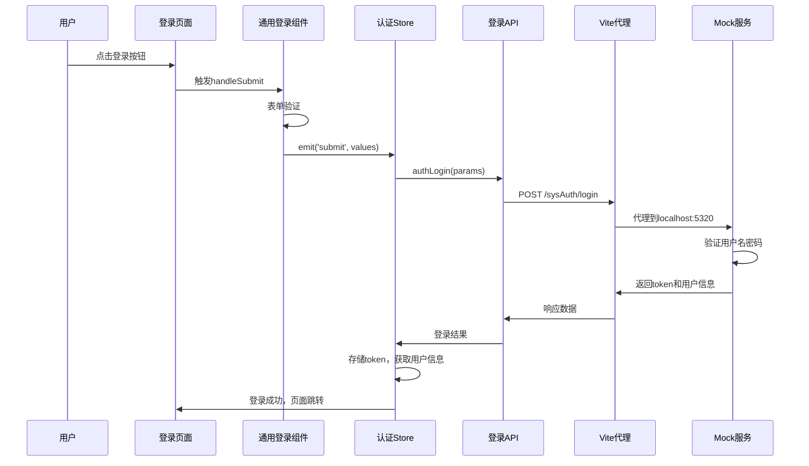

# 业务逻辑实现指南

本文档详细介绍了项目中各种业务功能的实现流程和调用链路，帮助开发者理解系统架构和业务逻辑。

## 1. 登录功能实现

### 1.1 环境配置与Mock服务

#### 环境配置文件
位置：`apps/web-ele/.env.development`

```bash
# 接口地址
VITE_GLOB_API_URL=http://121.41.88.18:9001/api

# 是否开启 Nitro Mock服务，true 为开启，false 为关闭
VITE_NITRO_MOCK=true
```

#### Mock服务启动机制
- 当 `VITE_NITRO_MOCK=true` 时，Vite插件会自动启动Nitro Mock服务
- Mock服务运行在 `http://localhost:5320` 端口
- 通过Vite代理配置，将 `/api` 请求转发到Mock服务

### 1.2 登录页面组件结构

#### 主要组件
- **登录页面**: `apps/web-ele/src/views/_core/authentication/login.vue`
- **通用登录组件**: `packages/effects/common-ui/src/ui/authentication/login.vue`
- **认证Store**: `apps/web-ele/src/store/auth.ts`

#### 组件关系
```
登录页面 → 通用登录组件 → 认证Store → 登录API → Mock服务
```

### 1.3 登录流程详解

#### 步骤1：表单验证
位置：`packages/effects/common-ui/src/ui/authentication/login.vue`

```typescript
async function handleSubmit() {
  const { valid } = await formApi.validate();
  const values = await formApi.getValues();
  if (valid) {
    localStorage.setItem(
      REMEMBER_ME_KEY,
      rememberMe.value ? values?.username : '',
    );
    emit('submit', values);
  }
}
```

#### 步骤2：调用认证Store
位置：`apps/web-ele/src/store/auth.ts`

```typescript
async function authLogin(
  params: Recordable<any>,
  onSuccess?: () => Promise<void> | void,
) {
  let userInfo: null | UserInfo = null;
  try {
    loginLoading.value = true;
    const { accessToken } = await loginApi(params);
    
    if (accessToken) {
      accessStore.setAccessToken(accessToken);
      // 获取用户信息和权限码
      const [fetchUserInfoResult, accessCodes] = await Promise.all([
        fetchUserInfo(),
        getAccessCodesApi(),
      ]);
      // 处理登录成功逻辑...
    }
  } finally {
    loginLoading.value = false;
  }
}
```

#### 步骤3：API请求配置
位置：`apps/web-ele/src/api/request.ts`

```typescript
const { apiURL } = useAppConfig(import.meta.env, import.meta.env.PROD);

export const requestClient = createRequestClient(apiURL, {
  responseReturn: 'data',
});
```

#### 步骤4：登录API调用
位置：`apps/web-ele/src/api/core/auth.ts`

```typescript
export async function loginApi(data) {
  return requestClient.post<AuthApi.LoginResult>('/sysAuth/login', data, {
    headers: {
      isToken: false,
    },
  });
}
```

#### 步骤5：Vite代理配置
位置：`apps/web-ele/vite.config.mts`

```typescript
server: {
  proxy: {
    '/api': {
      changeOrigin: true,
      rewrite: (path) => path.replace(/^\/api/, ''),
      target: 'http://localhost:5320',
      ws: true,
    },
  },
}
```

#### 步骤6：Mock服务响应
位置：`apps/backend-mock/api/auth/login.post.ts`

```typescript
export default defineEventHandler(async (event) => {
  const { password, account, code, codeId } = await readBody(event);

  // 验证账号密码（code和codeId仅接收但不验证）
  if (!password || !account) {
    setResponseStatus(event, 400);
    return useResponseError(
      'BadRequestException',
      'Account and password are required',
    );
  }

  const findUser = MOCK_USERS.find(
    (item) => item.username === account && item.password === password,
  );

  if (!findUser) {
    return forbiddenResponse(event, 'Account or password is incorrect.');
  }

  // 生成token
  const accessToken = generateAccessToken(findUser);
  const refreshToken = generateRefreshToken(findUser);

  setRefreshTokenCookie(event, refreshToken);

  return useResponseSuccess({
    ...findUser,
    accessToken,
  });
});
```

**支持的登录数据格式**：
```json
{
  "account": "FAQC",
  "password": "123456",
  "code": "5",
  "codeId": "21842883024069"
}
```

### 1.4 完整调用链路



### 1.5 Mock服务特点

- **自动启动**: 通过 `VITE_NITRO_MOCK=true` 自动启动
- **真实HTTP服务**: 不是简单的拦截器，而是真实的后端服务
- **支持复杂逻辑**: 可以处理文件上传、复杂业务逻辑等
- **开发便利**: 无需手动启动，集成在Vite开发服务器中
- **CORS支持**: 自动配置跨域请求头

### 1.6 Mock用户数据配置

#### 可用的测试账号
位置：`apps/backend-mock/utils/mock-data.ts`

| 账号 | 密码 | 角色 | 真实姓名 | 默认首页 |
|------|------|------|----------|----------|
| vben | 123456 | super | Vben | - |
| admin | 123456 | admin | Admin | /workspace |
| jack | 123456 | user | Jack | /analytics |
| FAQC | 123456 | admin | 富奥汽车 | /energy/overview |

#### 用户数据结构
```typescript
export interface UserInfo {
  id: number;
  password: string;
  realName: string;
  roles: string[];
  username: string;
  homePath?: string;
}
```

### 1.7 关键文件说明

| 文件路径 | 作用 | 说明 |
|---------|------|------|
| `apps/web-ele/.env.development` | 环境配置 | 配置API地址和Mock开关 |
| `apps/web-ele/vite.config.mts` | Vite配置 | 配置代理转发规则 |
| `apps/web-ele/src/views/_core/authentication/login.vue` | 登录页面 | 业务登录页面入口 |
| `packages/effects/common-ui/src/ui/authentication/login.vue` | 通用登录组件 | 可复用的登录表单组件 |
| `apps/web-ele/src/store/auth.ts` | 认证Store | 处理登录状态和用户信息 |
| `apps/web-ele/src/api/core/auth.ts` | 认证API | 登录相关的API接口 |
| `apps/web-ele/src/api/request.ts` | 请求客户端 | HTTP请求的统一配置 |
| `apps/backend-mock/api/sysAuth/login.post.ts` | Mock登录接口 | 模拟后端登录逻辑 |
| `apps/backend-mock/api/sysAuth/userInfo.get.ts` | Mock用户信息接口 | 获取用户详细信息和权限 |
| `apps/backend-mock/api/sysAuth/captcha.get.ts` | Mock验证码接口 | 生成验证码图片 |
| `apps/backend-mock/utils/mock-data.ts` | Mock数据配置 | 用户、权限、菜单等模拟数据 |
| `apps/web-ele/src/api/core/user-adapter.ts` | 用户数据适配器 | 转换API数据为前端格式 |

---

### 1.8 问题排查记录

#### 问题：登录请求返回HTML而不是JSON
**现象**：点击登录后浏览器控制台显示HTML内容而不是预期的JSON响应

**原因**：API路径不匹配导致请求被通配符路由捕获
- 前端请求：`/api/sysAuth/login`
- Mock API文件：`apps/backend-mock/api/auth/login.post.ts` (对应 `/api/auth/login`)

**解决方案**：
1. 创建正确的API文件路径：`apps/backend-mock/api/sysAuth/login.post.ts`
2. 重启开发服务器让Nitro识别新的API路由
3. 同时创建验证码API：`apps/backend-mock/api/sysAuth/captcha.get.ts`

**验证方法**：
```bash
# 测试登录API
curl -X POST http://localhost:5320/api/sysAuth/login \
  -H "Content-Type: application/json" \
  -d '{"account":"FAQC","password":"123456","code":"5","codeId":"123"}'

# 测试验证码API
curl http://localhost:5320/api/sysAuth/captcha
```

## 2. 用户信息获取功能

### 2.1 用户信息接口实现

#### API接口
位置：`apps/backend-mock/api/sysAuth/userInfo.get.ts`

```typescript
export default defineEventHandler(async (event) => {
  // 验证访问令牌
  const userinfo = verifyAccessToken(event);
  if (!userinfo) {
    return unAuthorizedResponse(event);
  }

  // 根据用户名获取对应的用户信息
  const mockUserInfoMap: Record<string, any> = {
    'FAQC': {
      account: 'FAQC',
      realName: '富奥汽车',
      avatar: null,
      introduction: '富奥汽车零部件有限公司管理员',
      address: '吉林省长春市',
      signature: '致力于汽车零部件制造与创新',
      orgId: 21255947002821,
      orgName: '富奥汽车',
      orgType: '201',
      posName: '系统管理员',
      buttons: [/* 权限按钮数组 */]
    }
    // 其他用户...
  };

  const currentUserInfo = mockUserInfoMap[userinfo.username] || mockUserInfoMap['FAQC'];
  return useResponseSuccess(currentUserInfo);
});
```

#### 数据结构说明
**ApiUserInfo接口结构**：
```typescript
interface ApiUserInfo {
  account: string;        // 用户账号
  realName: string;       // 真实姓名
  avatar: string | null;  // 头像URL
  introduction: string | null;  // 个人介绍
  address: string | null;       // 地址
  signature: string | null;     // 个性签名
  orgId: number;               // 组织ID
  orgName: string;             // 组织名称
  orgType: string;             // 组织类型
  posName: string | null;      // 职位名称
  buttons: string[];           // 权限按钮数组
}
```

### 2.2 前端数据适配

#### 适配器实现
位置：`apps/web-ele/src/api/core/user-adapter.ts`

前端通过适配器将API返回的数据转换为应用期望的UserInfo格式：
```typescript
export function transformApiUserInfo(apiUserInfo: ApiUserInfo): UserInfo {
  return {
    userId: apiUserInfo.orgId?.toString() || "",
    username: apiUserInfo.account || "",
    realName: apiUserInfo.realName || "",
    avatar: apiUserInfo.avatar || "/default-avatar.png",
    roles: deriveRolesFromButtons(apiUserInfo.buttons || []),
    desc: apiUserInfo.introduction || `${apiUserInfo.realName} - ${apiUserInfo.orgName}`,
    homePath: "/dashboard",
    token: "",
  };
}
```

---

## 常见问题 Q&A

### Q1: 登录时浏览器控制台返回HTML而不是JSON数据？

**A:** 这是API路径不匹配导致的问题。

**排查步骤：**
1. 检查前端API请求路径（如：`/sysAuth/login`）
2. 确认Mock API文件路径是否正确（应为：`apps/backend-mock/api/sysAuth/login.post.ts`）
3. 重启开发服务器让Nitro重新加载API路由
4. 使用curl测试API是否可访问：
   ```bash
   curl -X POST http://localhost:5320/api/sysAuth/login \
     -H "Content-Type: application/json" \
     -d '{"account":"FAQC","password":"123456"}'
   ```

### Q2: 如何添加新的Mock API接口？

**A:** 按照Nitro的文件路由规则创建API文件。

**步骤：**
1. 在 `apps/backend-mock/api/` 目录下创建对应路径的文件
2. 文件命名规则：`[路径].[HTTP方法].ts`（如：`login.post.ts`）
3. 重启开发服务器
4. API会自动映射到 `/api/[文件路径]`

### Q3: Mock用户数据在哪里配置？

**A:** 在 `apps/backend-mock/utils/mock-data.ts` 文件中。

**包含：**
- `MOCK_USERS`: 用户基本信息
- `MOCK_CODES`: 用户权限码
- `MOCK_MENUS`: 用户菜单数据

### Q4: 如何修改登录请求的数据格式？

**A:** 需要同时修改前端和后端。

**前端：** 修改 `apps/web-ele/src/api/core/auth.ts` 中的 `loginApi` 函数
**后端：** 修改对应的Mock API文件中的参数解析逻辑

### Q6: 如何添加新的Mock用户信息？

**A:** 在用户信息接口中添加对应的用户数据。

**步骤：**
1. 编辑 `apps/backend-mock/api/sysAuth/userInfo.get.ts`
2. 在 `mockUserInfoMap` 中添加新用户的详细信息
3. 确保数据结构符合 `ApiUserInfo` 接口规范
4. 重启开发服务器

**注意事项：**
- `buttons` 数组决定了用户的权限按钮
- `orgId` 会被转换为 `userId`
- `account` 字段必须与登录时的账号一致

---

## 待补充内容

后续可以在此文档中添加其他业务功能的实现说明，如：
- 权限管理流程
- 菜单路由生成
- 文件上传下载
- 数据表格操作
- 表单验证机制
- 等等...
